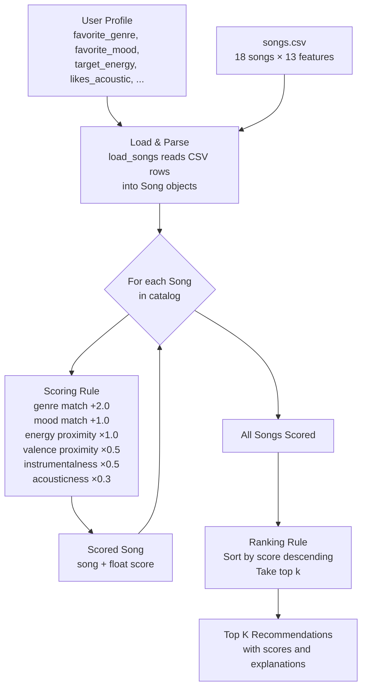
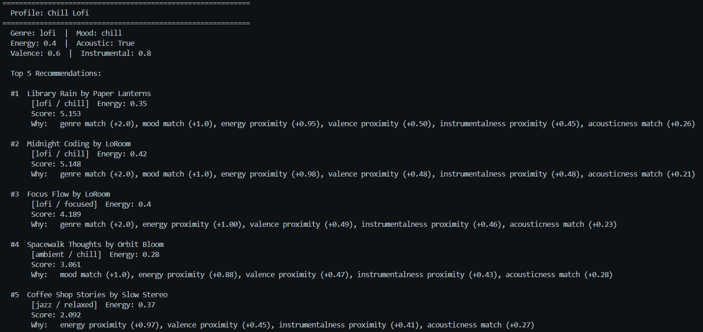
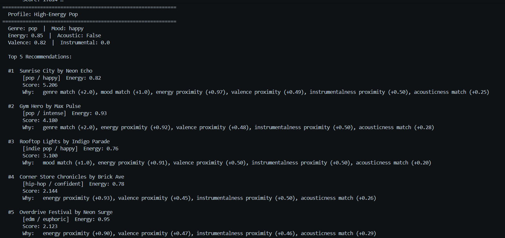
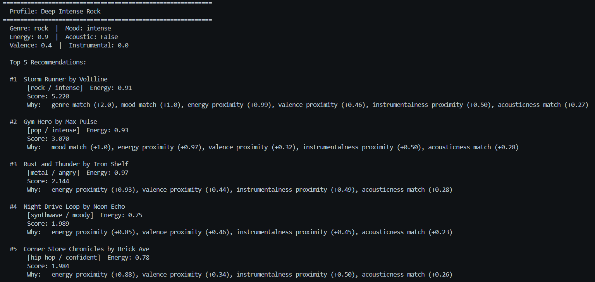
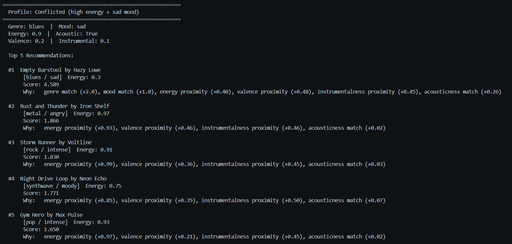
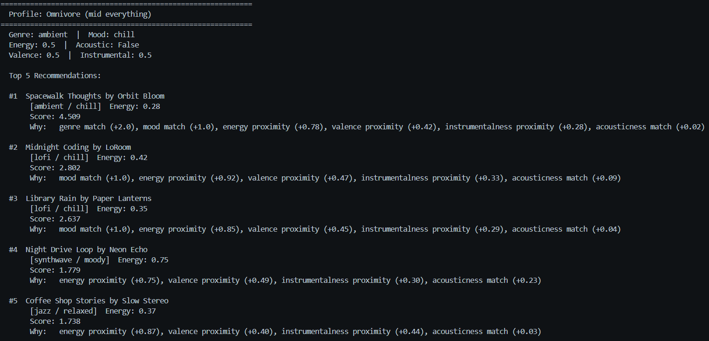
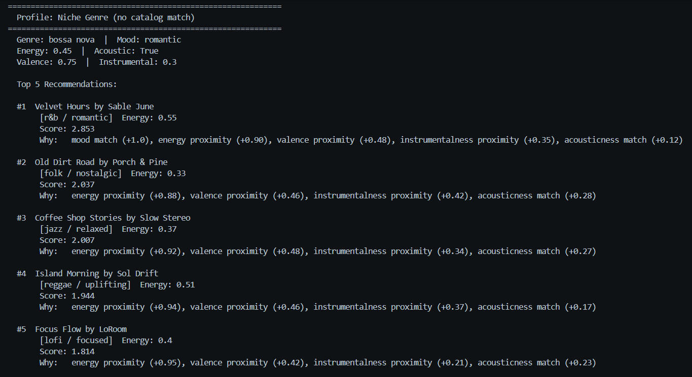

# 🎵 Music Recommender Simulation

## Project Summary

In this project you will build and explain a small music recommender system.

Your goal is to:

- Represent songs and a user "taste profile" as data
- Design a scoring rule that turns that data into recommendations
- Evaluate what your system gets right and wrong
- Reflect on how this mirrors real world AI recommenders

This version builds a content-based music recommender that scores every song
in an 18-song catalog against a user taste profile and returns the top 5 matches.
It uses a weighted formula combining genre, mood, energy, valence, instrumentalness,
and acousticness to calculate a relevance score per song. Songs are ranked by that
score and each recommendation includes a plain-language explanation of which
components contributed points. Six profiles were tested — from a typical lofi
listener to an adversarial "high-energy blues" profile — to expose where the
scoring logic works well and where it breaks down.
---

## How The System Works

Real-world recommenders like Spotify and YouTube use two main strategies: collaborative filtering (finding patterns across millions of users) and content-based filtering (matching song attributes to a listener's taste profile). This simulation focuses on content-based filtering — the system scores each song by comparing its audio and categorical features directly against what a specific user prefers. Rather than rewarding songs that are simply "high energy" or "happy," the scoring rule rewards proximity — songs closest to the user's stated preferences score highest. A weighted formula combines genre match, mood match, energy distance, acoustic texture, and emotional valence into a single score per song. Songs are then ranked by that score and the top results are returned as recommendations.

---

### Step 2: User Profile

The starter profile used for testing and comparison:

```python
user_prefs = {
    "favorite_genre":  "lofi",
    "favorite_mood":   "chill",
    "target_energy":   0.40,
    "likes_acoustic":  True,
    "target_valence":  0.60,
    "target_instrumentalness": 0.80,
}
```

**Profile critique — can it tell "intense rock" from "chill lofi"?**

Yes. A rock/intense song (e.g. Storm Runner: energy=0.91, acousticness=0.10, instrumentalness=0.00) would score near zero against this profile because:

- Genre mismatch → 0 points (worth +2.0)
- Mood mismatch → 0 points (worth +1.0)
- Energy distance = |0.91 − 0.40| = 0.51 → low similarity score
- acousticness 0.10 vs. likes_acoustic=True → 0 points
- instrumentalness 0.00 vs. target 0.80 → low similarity score

A lofi/chill song (e.g. Midnight Coding: energy=0.42, acousticness=0.71, instrumentalness=0.85) would score near maximum. The profile is specific enough to cleanly separate these two extremes. The only risk is being **too narrow** — a focused lofi track with slightly higher energy (0.55) might score lower than expected even though it would feel right. That is a known limitation.

---

### Step 3: Song and UserProfile Features

Each `Song` object uses the following attributes:

- `id` — unique identifier
- `title` — name of the song
- `artist` — name of the artist
- `genre` — broad style category (e.g. pop, lofi, rock, jazz, ambient)
- `mood` — emotional label (e.g. happy, chill, intense, focused, moody)
- `energy` — intensity level from 0.0 (very calm) to 1.0 (very intense)
- `tempo_bpm` — speed of the song in beats per minute
- `valence` — emotional direction from 0.0 (dark/sad) to 1.0 (bright/happy)
- `danceability` — how rhythmically suitable the song is for dancing (0.0–1.0)
- `acousticness` — how organic/acoustic vs. electronic/produced the song sounds (0.0–1.0)
- `speechiness` — proportion of spoken word vs. sung/instrumental content (0.0–1.0)
- `instrumentalness` — likelihood the track has no vocals (0.0–1.0)
- `liveness` — presence of live performance qualities such as crowd or room sound (0.0–1.0)

Each `UserProfile` stores the following preferences:

- `favorite_genre` — the genre the user most wants to hear
- `favorite_mood` — the emotional tone the user is in the mood for
- `target_energy` — the energy level the user is targeting (0.0–1.0)
- `likes_acoustic` — boolean indicating whether the user prefers acoustic over produced sound
- `target_valence` — preferred emotional brightness (0.0–1.0)
- `target_instrumentalness` — preferred level of vocal absence (0.0–1.0)

---

### Step 3: Algorithm Recipe (Scoring and Ranking)

### Scoring Rule

Computes a score for one song against one user profile:

```python
score = 0

# Categorical matches (exact)
if song.genre == user.favorite_genre:  score += 2.0
if song.mood  == user.favorite_mood:   score += 1.0

# Numerical proximity (1.0 − distance, scaled by weight)
score += (1.0 - abs(song.energy           - user.target_energy))          * 1.0
score += (1.0 - abs(song.valence          - user.target_valence))         * 0.5
score += (1.0 - abs(song.instrumentalness - user.target_instrumentalness))* 0.5
score += (1.0 - abs(song.acousticness     - (1.0 if user.likes_acoustic else 0.0))) * 0.3
```

Max possible score: 5.3

| Component                  | Max Points | Why this weight                             |
| -------------------------- | ---------- | ------------------------------------------- |
| Genre match                | +2.0       | Defines the sonic world — strongest signal  |
| Mood match                 | +1.0       | Defines the session intent                  |
| Energy proximity           | up to 1.0  | Most expressive numeric feature             |
| Valence proximity          | up to 0.5  | Emotional direction, secondary              |
| Instrumentalness proximity | up to 0.5  | Focus/background preference                 |
| Acousticness match         | up to 0.3  | Texture tiebreaker                          |

### Ranking Rule

Decides the final recommendation list:

```text
1. Score every song in the catalog using the scoring rule above
2. Sort all songs by score, highest first
3. Return the top k songs (default k=5)
4. For each result, record which components contributed to the score (explanation)
```

---

### Step 4: Data Flow



---

### Step 5: Expected Biases

- **Genre over-prioritization** — a +2.0 genre bonus means a mediocre genre match will almost always beat a strong cross-genre match. A great ambient track might be ignored for a lofi user even if every numeric feature aligns perfectly.
- **Mood rigidity** — the system treats mood as binary (match or no match). A "relaxed" song scores 0 mood points for a "chill" user even though those moods are very similar in practice.
- **Catalog skew** — with only 18 songs, some genres and moods have only one representative. A metal user will always get the same song recommended regardless of how features are weighted.
- **No history or context** — the system treats every session identically. A user's morning commute and late-night study session would receive the same recommendations if the profile doesn't change.

---

## Getting Started

### Setup

1. Create a virtual environment (optional but recommended):

   ```bash
   python -m venv .venv
   source .venv/bin/activate      # Mac or Linux
   .venv\Scripts\activate         # Windows

2. Install dependencies

```bash
pip install -r requirements.txt
```

3. Run the app:

```bash
python -m src.main
```

### Running Tests

Run the starter tests with:

```bash
pytest
```

You can add more tests in `tests/test_recommender.py`.

---

## Experiments You Tried

### Terminal Output Screenshots








**Experiment 1 — Weight shift (energy ×2, genre ÷2):**
Halving the genre weight from 2.0 to 1.0 and doubling the energy weight from
1.0 to 2.0 had the most impact on the "Conflicted" profile (blues/sad user
with target energy 0.90). Empty Barstool still ranked #1, but its lead over
the high-energy songs shrank significantly. Storm Runner and Rust and Thunder
moved up the list, making the output feel more honest for a user whose energy
preference genuinely conflicts with their genre. For consistent profiles like
Chill Lofi and High-Energy Pop, the change mostly reshuffled positions 2–5
without improving the top result.

**Experiment 2 — Adversarial and edge-case profiles:**
Three non-standard profiles were run alongside the three core profiles.
The "Conflicted" profile (high energy + sad blues) revealed that a genre+mood
bonus of +3.0 will almost always override numeric signals — Empty Barstool
(energy=0.30) ranked #1 for a user whose target energy was 0.90.
The "Omnivore" profile (all numeric targets at 0.5) produced reasonable but
uninspired results — the ambient/chill match won easily and the rest of the
list was predictable.
The "Niche Genre" profile (bossa nova — not in catalog) showed graceful
degradation: without the +2.0 genre bonus ever firing, the system fell back
on mood and numeric proximity and surfaced Velvet Hours and Coffee Shop
Stories, which are acoustically reasonable alternatives even though the
system had no musical knowledge of the relationship.

**Experiment 3 — Gym Hero across multiple profiles:**
Gym Hero (pop/intense, energy=0.93) appeared in both the High-Energy Pop and
Deep Intense Rock top 5 lists. It is a genre match for pop but not rock; it
is a mood match for rock (intense) but not pop (happy). The fact that it
surfaces for both high-energy profiles shows that energy proximity can pull
a song into results even when categorical fit is partial. This is not always
wrong, but it reveals that the system has no concept of "this song doesn't
belong here."

---

## Limitations and Risks

- **Tiny catalog:** 18 songs means some genres have only one representative.
  A metal fan will always get Rust and Thunder regardless of any other preferences.
- **Genre wall:** A +2.0 genre bonus is nearly impossible to overcome with
  numeric features alone. Songs outside a user's favorite genre are effectively
  second-class citizens even if they match every other preference perfectly.
- **Mood is binary:** "Relaxed" and "chill" score identically to "relaxed" and
  "metal" — both get 0 mood points. The system has no concept of similar moods.
- **No memory:** Every session is treated as the first. The system cannot learn
  that a user skipped all jazz results or always replays the #1 track.
- **No lyric or language awareness:** Two songs with identical numeric features
  but one in English and one in Japanese are treated as perfectly equivalent.

---

## Reflection

Read and complete `model_card.md`:

[**Model Card**](model_card.md)

Building this recommender made the mechanics of "personalization" feel much less
magical. A weighted scoring formula with six inputs is enough to produce results
that genuinely feel right most of the time — the Chill Lofi and Deep Intense
Rock profiles both surfaced obvious, accurate answers. But the conflicted profile
showed how quickly the math breaks down when a user's preferences pull in
opposite directions. The genre bonus won every time, even when it produced a
result the user almost certainly would not want. That trade-off — categorical
certainty vs. numeric honesty — is not a bug in this simulation; it shows up
in real products too.

The bigger lesson was about what data a system never sees. The catalog has no
bossa nova, so the bossa nova user gets reasonable-sounding alternatives found
through energy and acousticness proximity — not because the system understood
the musical relationship, but because the numbers happened to align. That is
both the strength and the ceiling of content-based filtering. It works within
the boundaries of what it was given. Anything outside those boundaries — a
genre it does not have, a mood it cannot name, a user preference it was never
taught to measure — becomes invisible.

---