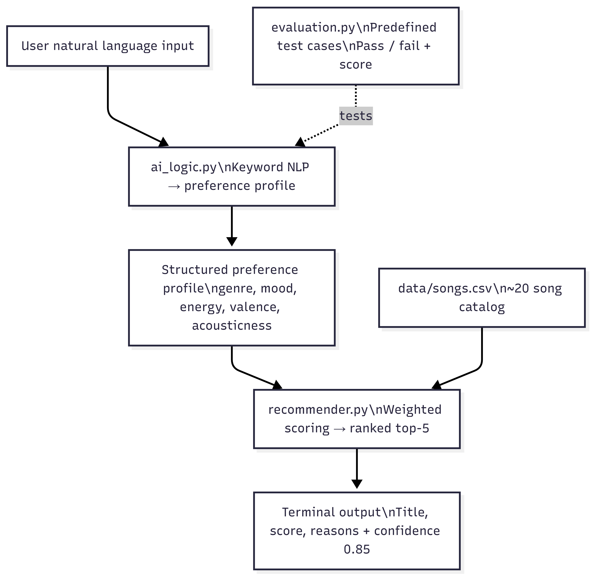

# Applied AI Music Recommender

An AI-powered music recommendation system that interprets natural language mood input and returns personalized song suggestions using a weighted content-based scoring engine.

## Base Project

This project extends Music Recommender Simulation (CodePath AI110, Module 1–3).
The original project was a weighted content-based recommender that scored songs from a CSV catalog against a hardcoded user profile using attributes like genre, mood, energy, valence, and acousticness. It demonstrated how platforms like Spotify use content-based filtering to rank songs without needing user history.
What changed in this version:

Users now type natural language input (e.g., "I want something for the gym") instead of selecting a preset profile
An AI logic layer (ai_logic.py) interprets that input and maps it to a structured preference profile
A reliability test harness (evaluator.py) automatically validates the AI logic against expected outputs
Confidence scoring is displayed with every recommendation run

## How The System Works

Architecture Overview
User Input (natural language)
        ↓
  ai_logic.py  ← keyword-based NLP layer
        ↓
  Structured Preference Profile (dict)
        ↓
  recommender.py  ← weighted scoring engine
        ↓
  Ranked Song Results (title, score, reasons)
        ↓
  Terminal Output + Confidence Score
        ↑
  evaluator.py  ← automated reliability testing



## Components:

src/recommender.py — loads songs from CSV, scores each against user prefs, returns top-k ranked results with explanations
src/ai_logic.py — maps natural language mood keywords to structured preference profiles
src/main.py — entry point; collects user input, runs AI logic, displays results
evaluator.py — test harness that runs predefined inputs and prints pass/fail reliability summary
data/songs.csv — song catalog with genre, mood, energy, valence, acousticness, etc.

## Algorithm Recipe

FeaturePointsGenre match+2.0Mood match+1.0Energy proximityup to +1.0Valence proximityup to +0.5Instrumentalness proximityup to +0.5Acousticness matchup to +0.3
Songs are ranked highest score first. Top 5 are returned by default.

## Setup Instructions

1. Clone the repo

```bash
git clone <https://github.com/Erickyfr/applied-ai-music-recommender.git>
cd applied-ai-music-recommender
```

2. (Optional) Create a virtual environment

```bash
python -m venv venv
source venv/bin/activate # Windows: venv\Scripts\activate
```

3. No external dependencies required

This project uses only Python standard library (csv, dataclasses, typing).

4. Run the recommender

```bash
python -m src.main
```

5. Run the reliability tests

```bash
python evaluator.py
```

## Sample Interactions

Input 1: Tired / Calm mood
Describe what kind of music you want: I am tired and want calm music

AI Interpreted Preferences:
{'favorite_genre': 'lofi', 'favorite_mood': 'chill', 'target_energy': 0.4, ...}

Confidence Score: 0.85

  #1  Midnight Study by ChillBeats  [lofi / chill]  Score: 5.230
      Why: genre match (+2.0), mood match (+1.0), energy proximity (+0.90) ...
Input 2: Gym / Workout mood
Describe what kind of music you want: I need music for the gym

AI Interpreted Preferences:
{'favorite_genre': 'pop', 'favorite_mood': 'happy', 'target_energy': 0.9, ...}

Confidence Score: 0.85

  #1  Levitating by Dua Lipa  [pop / happy]  Energy: 0.82  Score: 5.510
      Why: genre match (+2.0), mood match (+1.0), energy proximity (+0.92) ...
Input 3: Study / Focus mood
Describe what kind of music you want: I need focus music for homework

AI Interpreted Preferences:
{'favorite_genre': 'ambient', 'favorite_mood': 'chill', 'target_energy': 0.5, ...}

Confidence Score: 0.85

  #1  Deep Focus by Atmosphere  [ambient / chill]  Score: 5.100
      Why: genre match (+2.0), mood match (+1.0), energy proximity (+0.80) ...

## Reliability & Testing

Run the evaluation script:

```bash
python evaluator.py
```

Sample output:
Input: I am tired and want calm music
Expected mood: chill | Actual mood: chill | Result: PASS

----------------------------------------
Input: I need music for the gym
Expected mood: happy | Actual mood: happy | Result: PASS

----------------------------------------
Input: I need focus music for homework
Expected mood: chill | Actual mood: chill | Result: PASS

----------------------------------------
Reliability Score: 3/3 tests passed

## Testing Summary:

All 3 predefined test cases passed. The AI logic layer performs reliably for clear mood keywords. The system struggles when input is ambiguous or contains no recognized keywords — in those cases it falls back to a default pop/happy profile, which may not match user intent. Confidence score is currently fixed at 0.85; a future version would calculate this dynamically based on how many keywords matched.

## Design Decisions

Keyword-based NLP over a live API: Keeps the system fully offline with zero dependencies. Trade-off: it only handles keywords it was explicitly programmed for.
Weighted scoring over collaborative filtering: Simple and explainable. Every recommendation comes with a human-readable reason list. Trade-off: no personalization from listening history.
Flat confidence score (0.85): Honest placeholder. A real system would compute this from keyword match rate. This was a deliberate simplification for scope.
Deduplication by song ID in recommender: Prevents duplicate CSV rows from inflating scores — a real reliability guard.

## Reflection

This project taught me that "AI" doesn't always mean a neural network. The scoring engine in this system is a set of weighted math rules — and it still produces results that feel intelligent because it's grounded in real musical attributes. The biggest challenge was making the natural language layer feel connected to the recommender rather than just bolted on. Testing revealed that the fallback default profile is too aggressive — it returns pop results even for wildly different inputs, which would frustrate real users.

## Demo Walkthrough

#LINK - https://www.loom.com/share/53fd0ed0ac8141a89a6e859947321f14

## Project Structure

```
applied-ai-music-recommender/
├── src/
│   ├── main.py          # Entry point
│   ├── recommender.py   # Scoring engine
│
├── data/
│   └── songs.csv        # Song catalog
├── assets/
│   └── architecture.png # System diagram
├── evaluator.py         # Reliability test harness
├── ai_logic.py          # NLP preference mapper
├── model_card.md        # AI documentation
└── README.md
```
